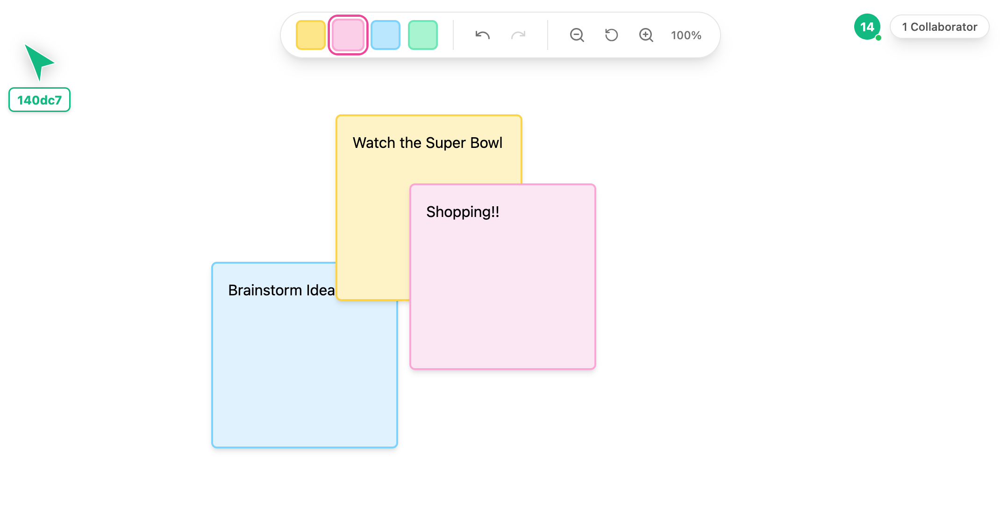

# Canvas - A Collaborative Drawing App



This project is built using [Zero](https://github.com/rocicorp/hello-zero), a powerful real-time sync engine that makes building collaborative apps easy. Special thanks to the Zero team for their amazing work!

## Prerequisites

- Node.js 20+
- Docker
- A [Neon](https://neon.tech) account for the database
- A [Koyeb](https://koyeb.com) account for deploying Zero cache
- A [Vercel](https://vercel.com) account for deploying the frontend

## Getting Started

### Step 1: Install Dependencies

```bash
git clone https://github.com/neondatabase-labs/canvas.git
cd canvas
npm install
```

### Step 2: Create a Neon Database

1. Sign up for a [Neon account](https://neon.tech)
2. Create a new project
3. Copy your database connection string (you'll need this for the next steps)
4. Apply the migration from `seed.sql`
5. Run:
```console
npx zero-deploy-permissions --schema-path='./src/schema.ts'  --output-file='/tmp/permissions_canvas.sql'
```
and run the content of that file in your DB

### Step 3: Run Locally

1. Create a `.env` file in your project root:

```bash
cp sample.env .env && rm sample.env

```

2. Start Zero cache:

```bash
npm run dev:zero-cache
```

3. In a new terminal, start the frontend:

```bash
npm run dev:ui
```

Your app should now be running at `http://localhost:5173`

### Step 4: Deploy Zero Cache to Koyeb

1. Sign up for a [Koyeb account](https://koyeb.com)
2. Create a new app and select "Deploy a Docker image"
3. Use the Zero Docker image
4. Configure the following environment variables:
   - `ZERO_UPSTREAM_DB`: Your Neon database connection string
   - `ZERO_REPLICA_FILE`: "/tmp/sync-replica.db"
   - `ZERO_PORT`: "8080" (or your preferred port)

### Step 5: Deploy Frontend to Vercel

1. Push your code to GitHub
2. Create a new project in [Vercel](https://vercel.com)
3. Connect your GitHub repository
4. Configure the following environment variables:
   - `VITE_PUBLIC_SERVER`: Your Koyeb app URL (e.g., "https://your-app.koyeb.app")
   - `ZERO_AUTH_SECRET`: A secure random string for authentication

## Architecture

- Frontend: React + Vite, hosted on Vercel
- Backend: Zero cache server, hosted on Koyeb
- Database: PostgreSQL, hosted on Neon

## Credits

This project is built on top of [Zero](https://github.com/rocicorp/hello-zero) by Rocicorp. Special thanks to the Zero team for creating such an amazing tool for building real-time collaborative applications.

## Deployment Providers

- [Koyeb](https://koyeb.com) - For hosting the Zero cache server
- [Vercel](https://vercel.com) - For hosting the frontend
- [Neon](https://neon.tech) - For hosting the PostgreSQL database

## License

MIT 